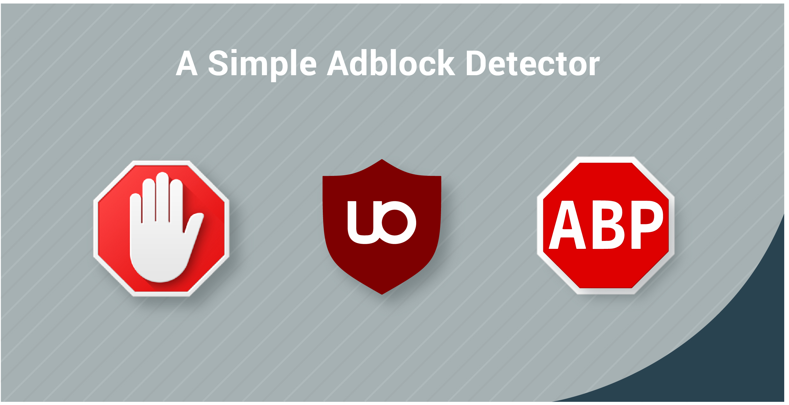

# Adblocker Detector Plus

Detect all visitors that use adblockers 

Show a message to the visitors, ask them to deactivate their adblocker. 
You can enable the option to shut down the message or to never disappear until they have deactivated the Adblocker. 

This plugin is developed from zero, it does not use bootstrap or any other tool that will add more weight to your website or even cause design or usability trouble. 

You can do the following: 

- Activate/Deactivate the plugin
-Activate/Deactivate the option to shut down the modal
- Save the plugin files for your web by any route 
 
 The installation can be done in 5 minutes maximum 
 

# If you need to run in localserver

1. please install npm
2. go to the root folder in an cli
3. run `npm install`
4. run `npm start`
5. go to `http://localhost:{PORT}` you can see the port on the cli 
 
